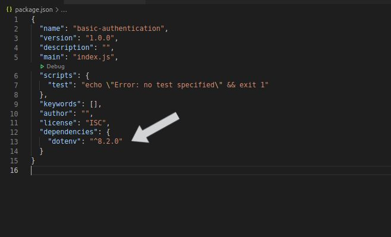
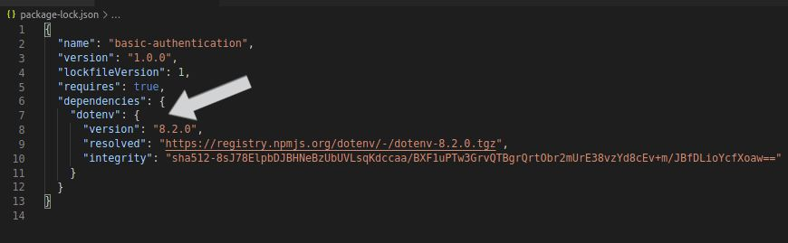
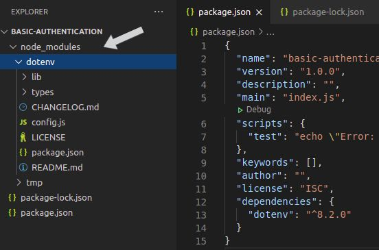

## Introduction to `npm` - 
- [`npm`](https://www.w3schools.com/whatis/whatis_`npm`.asp) is a package manager used to manage different dependencies in our application.

- We don't write usual data structures like stack, queues, etc. Almost every language has it's own implemented version of frequently used data structures and we will just import the appropriate library and start using it. Similarly, here also most of the common functionalities are already written by someone and published it publicly (yes, we can view the exact code they have written :D). So, whenever we require some common functionalities we will use their implementation. The only difference here is that they are available in the internet and we need to download them and put it appropriate folders so that compiler finds it (analogous to classpath in java). Now, it is time consuming and tedious task as every time we need to use some package we need to download them and put them in specific path in our project. Moreover, if we want to share our code to someone either we need to share entire project along with all the dependencies (which is huge wastage) or we share our code and ask the other person to download the dependencies themselves and they have to again find them and download them. 

- Suppose we go with the second approach, we share our code and ask the other person to install all the dependencies. How will other person know what all dependencies are there and which version of them we are using in our project? 

- Simplest solution is that we will share one more file mentioning all the dependencies, their versions, link to download them. 

- That is what `npm` does. In a very high level, it tracks for us which all dependencies are there in our project and what versions of them we are using and provides a simple command executing which we can easily install of the dependencies in a single go without us going to the wild internet and finding it. Interesting right? 

- Let's look at where `npm` stores all of our dependencies and their respective versions and where we can see the downloaded packages which `npm` installs for us.

  

## Tour of a simple project -
- In `package.json` file, we have all our dependencies listed along with their versions. The below image depicts exactly how it looks like - 

- In `package-lock.json` file, we again have all our dependencies details. Along with versions, it also contains other information like the exact path where we can find any particular dependency. Look at the below image, it shows how a basic `package-lock.json` file looks like -  If you want to try out you can type the given url in the browser `https://registry.`npm`js.org/dotenv/-/dotenv-8.2.0.tgz` and you will notice it is indeed the exact path of the package named "dotenv".

- As discussed in previous module, we know that it downloads exact packages inside our project. You can see the same here. Whenever you install any package, a folder is created under `node_modules` folder which contains all the dependencies (and other dependencies which our imported dependency required in turn). A simple `node_modules` folder looks something like - 

  